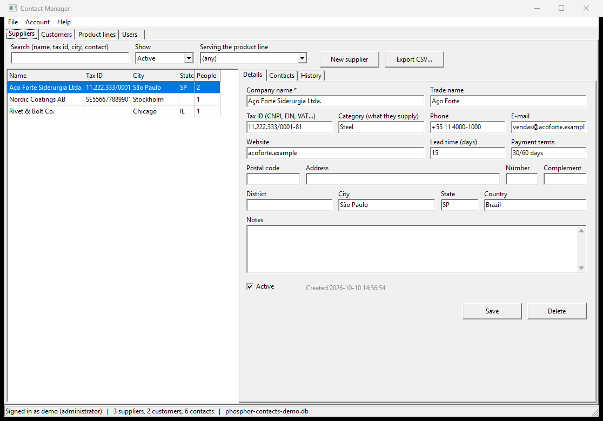
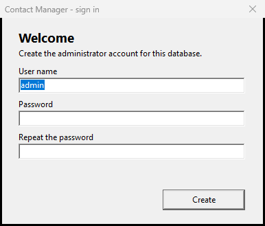
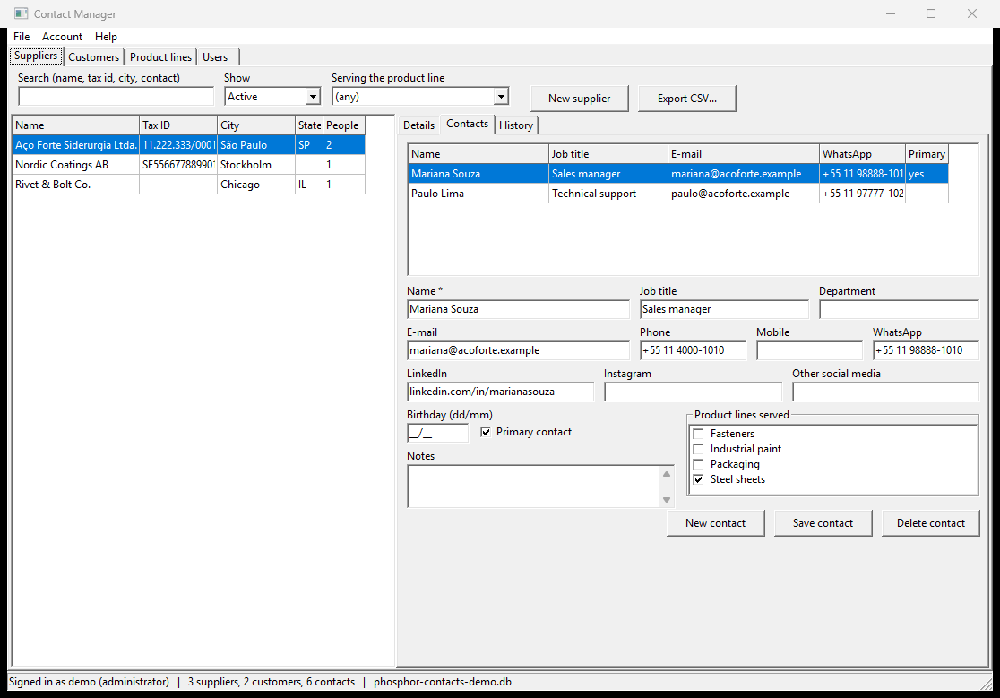
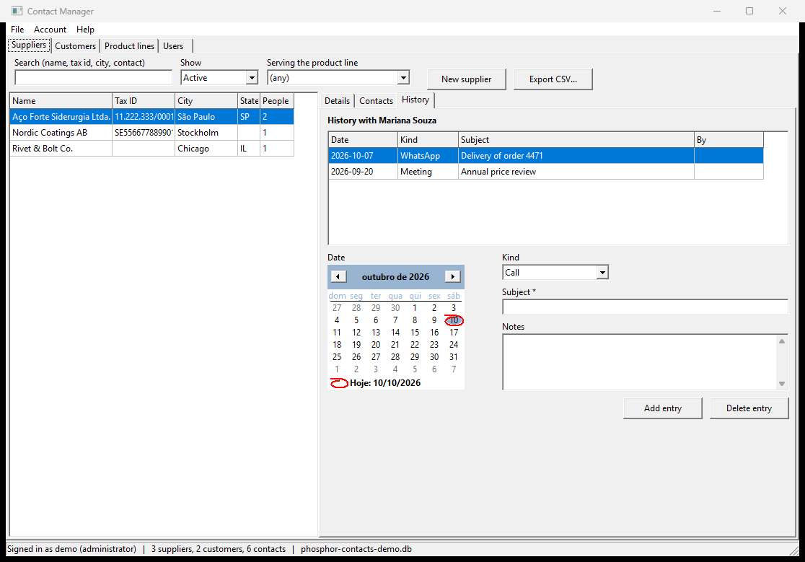

# Contact Manager — a whole application in Phosphor BASIC

[`examples/contact_manager.bas`](../examples/contact_manager.bas) is a desktop
program for the people a company buys from and sells to: suppliers and
customers, the contacts at each one, the product lines those contacts serve,
and a dated history of what was said to whom. It keeps everything in SQLite,
behind a login with users, roles and hashed passwords, and it is one file of
BASIC — about 1,500 lines, a third of them the self-test.

It is here for two reasons: to show what the language and its libraries add up
to, and because writing it was this project's first real use. It found five
things the test suites had not, listed at the end.



## Run it

It needs the SQLite runtime: `sqlite3.dll` beside `phosphor.exe` on Windows
(the 64-bit DLL from [sqlite.org](https://www.sqlite.org/download.html)), or
`libsqlite3` on Linux, which most distributions install already.

```bash
phosphor examples/contact_manager.bas
```

The first run asks you to create the administrator account and offers to load
a few sample companies.


 The data lives in `phosphor-contacts.db` in your
Documents folder; **File > Open database...** opens another one, and so does the
environment variable `PHOSPHOR_CONTACTS_DB`.

To look around without creating anything, start it with
`PHOSPHOR_CONTACTS_DEMO=1`: it opens a throw-away database in the temp folder
with the sample data, signed in as `demo` (password `demo123`).

```bash
PHOSPHOR_CONTACTS_DEMO=1 phosphor examples/contact_manager.bas
```

```powershell
$env:PHOSPHOR_CONTACTS_DEMO = '1'; phosphor examples\contact_manager.bas
```

## What it does

| page | what is on it |
| --- | --- |
| **Suppliers**, **Customers** | a list you can search by name, tax id, city or the name of a contact, and filter by active state and by the product line a contact serves. The selected company's **Details** (address, tax id, category or segment, lead time or credit limit, payment terms, notes, active flag, who created and changed it), its **Contacts**, and the **History** of the selected contact. A double click on a company opens its contacts |
| Contacts | name, job title, department, e-mail, phone, mobile, WhatsApp, LinkedIn, Instagram and other social media, birthday, notes, a primary-contact flag (one per company), and the product lines the contact serves |
| History | dated entries per contact — a call, a meeting, an e-mail, a WhatsApp message, a visit — with a subject, notes and who wrote it |
| **Product lines** | the lines your contacts serve, used by the contacts' check list and by the filters |
| **Users** | administrators only: users, their role (administrator or operator), whether they may sign in, and their passwords |

The **File** menu exports suppliers or customers to CSV (one row per contact,
with the product lines it serves) and backs the database up; **Account**
changes your own password and signs out.





## How it is built

### SQLite carries the rules

The schema (`create_schema` in the program) makes the database refuse what the
program should never write, so a bug in the BASIC cannot corrupt it:

- **Foreign keys with `ON DELETE CASCADE`.** Deleting a company deletes its
  contacts, their product-line links and their history in one statement.
  `PRAGMA foreign_keys = ON` is run on every open, because SQLite leaves it off.
- **`ON DELETE SET NULL`** on "who created this": deleting a user keeps their
  records.
- **A partial unique index** — one tax id per kind of company, while many may
  leave it blank: `CREATE UNIQUE INDEX ... ON companies(kind, tax_id) WHERE tax_id <> ''`.
- **`COLLATE NOCASE`** on user names and product-line names, so `Olivia` and
  `olivia` are the same user.
- **A transaction** around saving a contact, its primary flag and its product
  lines: all of it or none of it.

And **every value is bound**, never pasted into SQL — `?1`, `?2` and
`sqlite_bindstr` / `sqlite_bindnum` — so a company called `O'Brien; DROP TABLE`
is just a name:

```basic
s@ = sqlite_prepare@(db@, "SELECT id, password, role, active FROM users WHERE username = ?1")
sqlite_bindstr(s@, 1, u$)
if sqlite_step(s@) = 1 then rec$ = sqlite_gets$(s@, "password")
sqlite_finalize(s@)
```

### Passwords are never stored

A password becomes a salted PBKDF2 record with `password_hash$`, and the login
asks `password_verify?` whether a typed password matches it
([libraries/crypto.md](libraries/crypto.md)). An unknown user name and a wrong
password get the same message, so the login does not tell a stranger which
names exist. The last active administrator cannot be demoted, deactivated or
deleted, so someone can always manage the users.

### The windows

Every window is built in code: `form@`, a `mainmenu@`, a `statusbar@`, a
`pagecontrol@` with `tabsheet@` pages, and on them panels and group boxes,
`edit@` (with `PasswordChar` for passwords), a `maskedit@` for the birthday,
`memo@`, `combobox@` in drop-down-list style, a `checklistbox@` of product lines,
`checkbox@`, a `calendar@` and `button@`. The lists are `stringgrid@`s used as
record lists — whole-row selection, `stringgrid_onselect@` to load the picked
record, `stringgrid_colwidth@` for the columns, `control_ondblclick@` on the
company list. Messages, confirmations and the open and save dialogs are the
library's own.

Handlers are ordinary functions bound by name, and one handler serves both the
supplier and the customer page: each control carries the page's number in its
tag, and the handler reads `control_tag(sender@)`.

```basic
f@ = form@("Suppliers")
save@ = button@(f@)
button_caption@(save@, "Save")
control_tag@(save@, 1)          rem 1 = the suppliers page, 2 = the customers page
button_onclick@(save@, "on_company_save")

function on_company_save(sender@) local k
  k = control_tag(sender@)
  println "saving a record on page " + str$(k)
  return 0
endfunction
```

Phosphor has no modal forms, so **Change my password** disables the main window
while its own is open and enables it again when it closes.

### It tests itself

With `PHOSPHOR_SELFTEST=1` the program builds every window **without showing
one**, and drives them as a person would — typing with `edit_text@`, clicking
with `button_click@` and `menuitem_click@`, picking rows with
`stringgrid_cursor@`, double-clicking with `control_dblclick@` — against a
throw-away database, then checks what landed in SQLite: 75 checks, from the
first-run administrator to a cascade delete, the CSV file and an operator who
cannot see the Users page. Its message and confirmation boxes go through one
function the test answers. `scripts/test-examples` runs it that way on Windows
and on Linux (under `xvfb-run`), and the checks were each seen to fail with the
rule they check broken on purpose.

## What writing it changed in Phosphor

A real program finds what a test suite written by the same people does not:

- **The engine had no hash at all.** The crypto library
  ([libraries/crypto.md](libraries/crypto.md)) came from this program's login.
- **A grid could not say which row was picked**, nothing could take a double
  click, and every column had one width: `stringgrid_row` / `stringgrid_col` /
  `stringgrid_cursor@` / `stringgrid_onselect@`, `control_ondblclick@` /
  `control_dblclick@` and `stringgrid_colwidth@` came from its lists.
- **A `/` in an edit mask is not a slash.** The birthday field showed `14/03` on
  Windows and `14-  ` on Linux: the LCL reads `/` as the system's date
  separator. [libraries/gui-edit.md](libraries/gui-edit.md) now says so; `\/`
  is a slash everywhere.
- **Still open: a program cannot read command-line arguments** —
  `phosphor run app.bas --x` is refused — which is why this one takes its
  switches from the environment.
- **Still open: there are no modal forms.**
